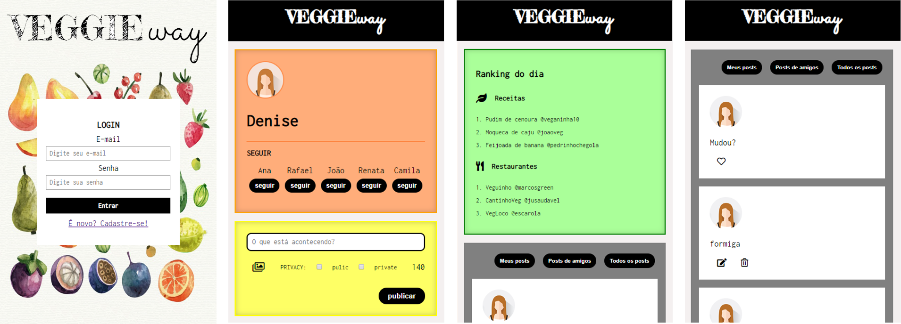

# Veggieway
A social network for vegans, vegetarians and those interested in the subject. The main intention is sharing personal experiences, exchange recipes and tips of restaurants.

## Motivation
It was the final project of the third sprint of Laboratoria bootcamp. Working in pairs, the goal was to build a mobile first social network, with registration / login page, possibility to follow users, to publish and delete messages and filter visualizations.

## Appearance

## Technology Stack
+ HTML5
+ CSS3
+ jQuery
+ Firebase

## Oficial Roadmap

#### versão 3.0.0 (scheduled for January 2019)
+ Make the best recipes and favorite restaurants ranking works;
+ Put the app on the air.

#### version 2.0.0 (scheduled for November 2018)
+ Enable the insertion of photos;
+ Code refactoring (using ES6).

#### version 1.0.0 (released)
+ Presents the basic features of a social networking. You can follow friends and make a post, but still can't insert photos.

